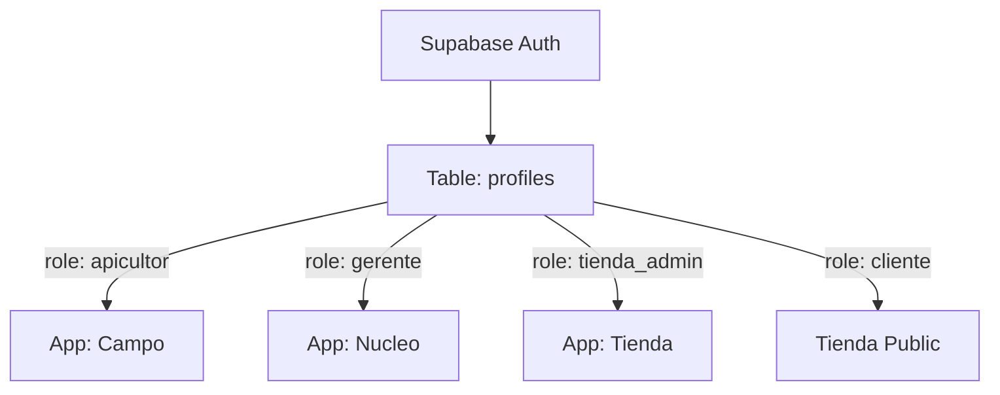

# Arquitectura del Sistema — Enjambre Legado

## 1. Topología del Monorepo

El proyecto utiliza una arquitectura de Monorepo para maximizar la reutilización de lógica de negocio y asegurar la consistencia entre plataformas.

### Aplicaciones (`apps/`)
- **`tienda`**: (Next.js 16) - El e-commerce de cara al público y el panel de administración comercial.
- **`nucleo`**: (Vite + React) - Dashboard de gestión integral para el Gerente y roles administrativos.
- **`campo`**: (Next.js) - Aplicación PWA optimizada para uso en terreno por apicultores.
- **`api`**: (Hono/Node.js) - Backend ligero para integraciones de terceros y tareas programadas.
- **`eirl`**: (Next.js) - Módulo especializado en contabilidad y reportes tributarios.

### Paquetes Compartidos (`packages/`)
- **`database`**: Contiene las migraciones de Supabase y las definiciones de tipos de la base de datos.
- **`contable`**: Lógica de cálculo de impuestos, SII y conciliación bancaria.
- **`auth`**: Helpers y middleware compartidos para la gestión de sesiones.
- **`ui`**: Librería de componentes base (diseño sistema).
- **`ai`**: Integraciones con modelos de lenguaje para análisis de datos y predicción de cosechas.

---

## 2. Flujo de Datos y Autenticación

### Identidad Centralizada
La autenticación se gestiona vía **Supabase Auth**. La tabla `profiles` en el esquema público es el nexo de unión, vinculando el `uuid` de auth con un `role` específico.

### Estrategia de Base de Datos
- **Postgres**: Almacenamiento relacional.
- **PostGIS**: Gestión de coordenadas geográficas de apiarios y colmenas.
- **RLS (Row Level Security)**: Las políticas de seguridad están definidas a nivel de base de datos para prevenir fugas de información entre roles.

---

## 3. Integraciones Clave
- **SII / Transbank**: Gestionadas mediante el paquete `@enjambre/contable`.
- **Blockchain**: (Opcional/Planificado) para la certificación de origen de lotes de miel.
- **IA**: Análisis sensorial y predicción de floración basado en datos meteorológicos y de inspección.

---

## 4. Stack Tecnológico General
- **Frameworks**: Next.js, Vite, Hono.
- **Estilos**: Tailwind CSS + Custom CSS Variables.
- **Animaciones**: GSAP, Framer Motion.
- **Base de Datos**: Supabase (Postgres, Auth, Storage).
- **Gestión de Monorepo**: Turborepo + pnpm.
