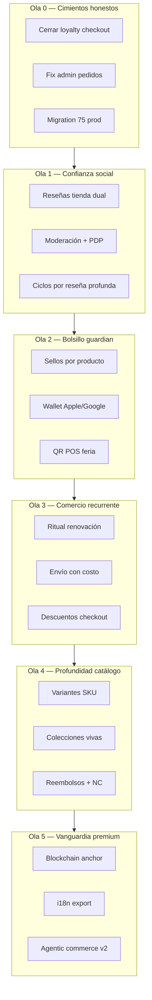

# Plan Colosal — Ecosistema Comercial OYZ

> **Hoja de ruta maestra** para la app personalizada La Obrera y el Zángano: comercio soberano, fidelización profunda, wallet, ritual recurrente, reseñas duales (anónimas vs guardian), y vanguardia biocultural.
>
> **No migramos a Shopify.** Inspiración mecánica sí; alma OYZ siempre.
>
> **Estado:** Plan v1 — Junio 2026  
> **Documentos satélite:** [`COMERCIO_SOBERANO.md`](./COMERCIO_SOBERANO.md) · [`WALLET_GUARDIAN.md`](./WALLET_GUARDIAN.md) · [`SOBERANIA_FISCAL.md`](./SOBERANIA_FISCAL.md) · [`CONSTITUTION.md`](./CONSTITUTION.md)

---

## 0. Norte estratégico

```
Shopify = andamio invisible (carrito, pago, orden)
OYZ     = bosque visible (trama, ritual, guardian, Chile real)
```

**Métricas de éxito (12 meses):**

| Métrica | Hoy | Objetivo |
|---------|-----|----------|
| Checkout → fulfill sin deuda UX | 🟡 puntos cosméticos | 100% loops cerrados |
| Reseñas en PDP tienda | ⬜ cero | ≥30% PDP con huella sensorial |
| Registro post-reseña anónima | — | ≥25% conversión a cuenta |
| Wallet passes activos | ⬜ | ≥15% guardians con pass |
| Ritual M2 retention | ⬜ sin motor | ≥60% renovación mes 2 |
| Boleta 39 auto post-web | 🟡 flag | ≥95% ventas web |

---

## 1. Mapa de oleadas (visión global)



---

## 2. Ola 0 — Cimientos honestos (2–3 semanas)

> *Antes de crecer, el producto no debe mentir en UI.*

| ID | Epic | Estado código | Entregables | Archivos / tablas |
|----|------|---------------|-------------|-------------------|
| 0.1 | **Puntos reales en checkout** | ✅ Jun 2026 | BFF valida saldo; Flow cobra total neto; canje idempotente en fulfill | `@enjambre/pricing/loyalty-checkout`, `checkout.ts`, `loyalty-fulfill.ts`, mig **76** |
| 0.2 | **Ciclos en venta web** | ✅ Jun 2026 | `ciclos` + `agregar_puntos_usuario` post-fulfill | `loyalty-fulfill.ts` |
| 0.3 | **Fix pedidos admin** | ✅ Jun 2026 | `TiendaPanel` select `productos`; `/perfil/pedidos` ya usa `user_id` | `TiendaPanel.tsx` |
| 0.4 | **Prod DB** | ⬜ pendiente ops | Migrations **74–76** en remoto | `pnpm go-live:db-push` |
| 0.5 | **Flow prod** | ⬜ pendiente ops | Env Flow + smoke checkout | Vercel núcleo |

**DoD Ola 0:** Compra logueada → puntos suben → ciclos suben → email confirmación → pedido visible en `/perfil/pedidos`.

### Análisis quirúrgico Ola 0 (ramificaciones)

| Cambio | Seguridad | Funcionalidad | Eficacia |
|--------|-----------|---------------|----------|
| Canje solo en BFF + RPC `canjear_puntos_checkout` | Evita manipular descuento desde cliente; invitados rechazados (`401`) | Total Flow = `computePaidTotal(subtotal - descuento)`; sesión guarda auditoría | Pago alineado con monto real |
| `validatePointsRedeemInput` en `@enjambre/pricing` | Paso 100 pts; tope por subtotal (mín $1 CLP) | Corrige slider UI que permitía descuento > total | Una sola fuente de verdad cliente/servidor |
| Fallo canje post-pago → `fulfill` error | Pago autorizado sin venta si puntos insuficientes (race) — igual que stock gate | Ops debe reconciliar vía `payment_failures` | Rare si init validó saldo |
| `maxRedeemablePoints` en hook tienda | — | Slider acotado al subtotal real | UX coherente |
| Ciclos idempotentes por `venta_id` | — | Re-commit webhook no duplica ciclos | Paridad con POS claim |

---

## 3. Ola 1 — Reseñas en Tienda (la brecha que señalaste)

### 3.1 Estado actual

| Pieza | Ubicación | Gap |
|-------|-----------|-----|
| Tabla `resenas_sensoriales` | migración 11 | Solo `user_id` obligatorio; sin `producto_id`, sin anónimas |
| Admin CRM | `ResenasSensorialesTab.tsx` | Lee reseñas; no modera desde tienda |
| **Tienda PDP** | `producto/[slug]/` | **Cero UI de reseñas** |
| Post-compra | — | No pide reseña |
| Judge.me equivalente | — | No existe |

### 3.2 Filosofía: dos modos, un mismo bosque

No es “reseña buena vs mala”. Es **profundidad vs fricción** — y la UI debe hacer deseable el registro sin bloquear la voz anónima.

#### Comparativa (copy y producto)

| Dimensión | Reseña **anónima** | Reseña **guardian** (registrada) |
|-----------|-------------------|----------------------------------|
| **Fricción** | Baja — sin cuenta | Requiere login/registro |
| **Formulario** | Estrellas 1–5 + texto corto (≤280) + opcional nickname | **Huella sensorial completa** + notas largas |
| **Campos** | `rating`, `comentario_corto` | `cristalizacion_percibida`, `familia_aromatica`, `intensidad_fondo` 1–10, `notas_personales`, `momento_consumo`, `par_con_alimentos` |
| **Vínculo compra** | No verificable | Badge **“Compra verificada”** si `venta_id` / `lote_id` del pedido |
| **Visibilidad PDP** | Sección “voces del bosque” — orden inferior, sin foto tier | Destacadas arriba, avatar/tier, enlace a perfil público opcional |
| **Moderación** | Cola estricta + rate limit IP | Fast-track si compra verificada |
| **Recompensa** | Gratitud copy (“gracias por nutrir el bosque”) | **+ciclos** (`accion_tipo: resena_sensorial`), elegibilidad sello wallet, puntos bonus |
| **Inmutabilidad** | Sí (como hoy) | Sí |
| **Edición** | No | No (solo admin hide) |
| **SEO** | Agrega a `aggregateRating` con peso menor | Peso mayor en JSON-LD |
| **Anti-spam** | Honeypot + Turnstile + 1/24h por IP/producto | 1 reseña profunda / producto / 90 días (salvo nuevo lote comprado) |

#### Incentivo explícito a registrarse (UX)

Tras enviar reseña anónima, modal:

> *“Tu voz ya está en el bosque. Si creas tu pasaporte guardian, esta reseña puede convertirse en **Huella Sensorial**: vincular tu lote, ganar ciclos y aparecer destacada. ¿Te unes al enjambre?”*

CTA: `Crear cuenta` / `Iniciar sesión` con `returnTo` + `?claimReview={token}`.

### 3.3 Modelo de datos (migración 77)

Evolucionar `resenas_sensoriales` → **`resenas_producto`** (o ALTER amplio):

```sql
-- Campos nuevos (resumen)
producto_id       UUID NOT NULL REFERENCES productos(id)
modo              TEXT NOT NULL CHECK (modo IN ('anonima', 'guardian'))
estado            TEXT NOT NULL DEFAULT 'pendiente'
                  CHECK (estado IN ('pendiente','aprobada','rechazada','oculta'))
rating            SMALLINT CHECK (rating BETWEEN 1 AND 5)  -- requerido ambos modos
comentario_corto  TEXT                                     -- anónima: principal
-- guardian / profundo:
cristalizacion_percibida, familia_aromatica, intensidad_fondo, notas_personales
momento_consumo   TEXT
maridaje          TEXT
venta_id          TEXT REFERENCES ventas(id)              -- compra verificada
user_id           UUID REFERENCES profiles(id)            -- NULL si anónima
anon_hash         TEXT                                    -- SHA256(ip+ua+salt) rate limit
display_name      TEXT                                    -- nickname anónimo o nombre perfil
ciclos_otorgados  NUMERIC DEFAULT 0
created_at        TIMESTAMPTZ DEFAULT now()
```

**Tabla auxiliar:** `resenas_claim_tokens` — permite elevar anónima → guardian tras registro (ventana 7 días).

**RLS:**

- `INSERT` anónima: vía **BFF** `service_role` tras validación (no insert directo cliente).
- `INSERT` guardian: `auth.uid() = user_id`.
- `SELECT` público: solo `estado = 'aprobada'`.
- Admin: gerente modera en Núcleo.

### 3.4 API (Núcleo BFF)

| Método | Ruta | Descripción |
|--------|------|-------------|
| `POST` | `/api/resenas` | Crear anónima o guardian (Zod discriminated union) |
| `GET` | `/api/resenas?producto_id=&modo=` | Listado público PDP (paginado) |
| `POST` | `/api/resenas/claim` | Vincular anónima post-registro |
| `PATCH` | `/api/resenas/:id/moderar` | Admin: aprobar / rechazar / ocultar |
| `GET` | `/api/resenas/eligible` | ¿Usuario puede reseñar? (compró producto, cooldown) |

### 3.5 UI Tienda

| Superficie | Componente | Notas |
|------------|------------|-------|
| PDP `/producto/[slug]` | `ResenasSection` | Tabs: Destacadas (guardian) · Comunidad (mix) · Escribir |
| Modal escribir | `ResenaComposer` | Toggle “Rápida (sin cuenta)” vs “Profunda (guardian)” — **la profunda se ve más bella** (GSAP, más campos, preview) |
| Post-checkout | `ResenaInvite` | Email + banner en `/checkout/resultado` |
| Perfil | `/perfil/resenas` | Historial propio + estado moderación |
| JSON-LD | `json-ld.ts` | `aggregateRating`, `review` |

### 3.6 UI Núcleo

- Extender `ResenasSensorialesTab` → cola moderación, filtros `pendiente`, bulk approve.
- Métricas: % anónimas vs guardian, conversión claim, rating promedio por SKU.

### 3.7 Paquete propuesto

`@enjambre/resenas` — schemas Zod, tipos modo, helpers elegibilidad, copy incentivo.

### 3.8 DoD Ola 1

- [x] Anónima publicable en PDP tras moderación — `ResenaComposer`, mig **77**, BFF `POST /api/resenas`
- [x] Guardian con huella sensorial + badge compra verificada — `ResenasSection`, elegibilidad por `ventas`
- [x] +ciclos al aprobar reseña guardian con venta vinculada — RPC `moderar_resena_producto`
- [x] Claim post-registro funciona — `resenas_claim_tokens`, `POST /api/resenas/claim`
- [x] Rate limit anti-spam activo — `anon_hash` + 3/día por producto
- [x] JSON-LD válido en PDP — `aggregateRating` + `review` en `json-ld.ts`
- [ ] **Prod DB** — mig **77** pendiente `pnpm go-live:db-push`

**Esfuerzo estimado:** M (3–4 semanas) — **código listo Jun 2026; falta push DB**

---

## 4. Ola 2 — Wallet Guardian y sellos

Ver [`WALLET_GUARDIAN.md`](./WALLET_GUARDIAN.md).

| ID | Entregable | Estado |
|----|------------|--------|
| 2.1 | Migración `guardian_stamp_programs` + `guardian_stamp_progress` | ✅ mig **78** |
| 2.2 | Incremento en `fulfillCheckout` + claim POS (trigger) | ✅ `stamp-fulfill`, trigger `trigger_stamps_on_claim` |
| 2.3 | Perfil: “Te faltan N sachets” | ✅ `GuardianStampsSection`, `/perfil`, `/perfil/canje` |
| 2.4 | `@enjambre/wallet` — Apple pass JSON | ✅ `GET /api/wallet/apple/download` (unsigned sin certs) |
| 2.5 | Google Save to Wallet | 🟡 stub `POST /api/wallet/google/save-link` |
| 2.6 | PassKit push updates | 🟡 `wallet_pass_registrations` + log queue |
| 2.7 | QR en feria | ✅ `POST /api/wallet/qr/resolve` + proxy Campo |
| 2.8 | **Prod DB** | ⬜ `pnpm go-live:db-push` (mig **78**) |

**Sinergia reseñas:** reseña guardian aprobada → `bonus_stamp_resena` (+1 sello si `bonus_resena=true`).

---

## 5. Ola 3 — Comercio recurrente y checkout completo

| ID | Epic | Detalle |
|----|------|---------|
| 3.1 | **Ritual motor** | Cron renovación, `subscription_deliveries`, dunning, pause/skip UI |
| 3.2 | **Flow Subscriptions** o re-checkout mensual | Evaluar API Flow vs cargo manual |
| 3.3 | **Envío** | Tarifas flat región → API BlueExpress; `shippingCost` en total |
| 3.4 | **Descuentos** | Wire `descuentos` + códigos creador en `@enjambre/pricing` |
| 3.5 | **Stock reservation** | Hold 30 min en `checkout_sessions` |
| 3.6 | **Checkout cinematográfico** | GSAP resultado, micro-copy bosque |

---

## 6. Ola 4 — Catálogo y post-venta Shopify-parity

| ID | Epic |
|----|------|
| 4.1 | `producto_variantes` + admin + carrito por variant |
| 4.2 | Colecciones `coleccion_productos` + smart tags |
| 4.3 | Reembolsos BFF + Flow/Transbank reverse + nota crédito 61 |
| 4.4 | Portal devoluciones self-serve |
| 4.5 | Búsqueda server-side + filtros impacto/lote |

---

## 7. Ola 5 — Vanguardia premium

| ID | Epic |
|----|------|
| 5.1 | `blockchain_anchors` on-chain + QR trazabilidad completo |
| 5.2 | `next-intl` EN para export Dubai/Asia |
| 5.3 | `guardian_profiles` migrado + pasaporte público |
| 5.4 | Agentic commerce: agente puede pausar ritual, consultar sellos wallet |
| 5.5 | Experiencias `/experiencias` booking + tickets |

---

## 8. Matriz inspiración Shopify → Ola

| Inspiración Shopify | Ola | Epic ID |
|--------------------|-----|---------|
| Smile / LoyaltyLion | 0, 2 | 0.1, 2.1 |
| Stamp Me | 2 | 2.1–2.3 |
| PassKit | 2 | 2.4–2.6 |
| ReCharge | 3 | 3.1–3.2 |
| Judge.me / Okendo | **1** | **3.x reseñas** |
| Klaviyo | 0, 1, 3 | notificaciones + invite reseña post-compra |
| Route | 3 | 3.3 |
| Bold Discounts | 3 | 3.4 |

---

## 9. Dependencias críticas (DAG)

```
0.1 puntos checkout ──┬──► 2.1 sellos (total correcto)
0.4 migration prod ───┤
                      ├──► 1.x reseñas (venta_id verificada)
                      └──► 3.1 ritual

1.x reseñas ──────────► 1.3 ciclos reseña ──► 2.7 wallet badge

2.1 sellos ───────────► 2.4 wallet

3.1 ritual ───────────► 3.2 Flow recurring
```

---

## 10. Riesgos y mitigaciones

| Riesgo | Mitigación |
|--------|------------|
| Reseñas spam anónimas | BFF-only insert, Turnstile, moderación, rate limit |
| Reseñas fake guardian | Exigir `venta_id` para badge “verificada”; profunda sin venta = sin ciclos |
| Wallet certs Apple costoso | Fase 2.4 solo tras sellos estables; PWA card interim opcional |
| Scope creep | Una ola activa; no iniciar O2 hasta DoD O1 |
| Legal reseñas Chile | Términos en `/privacidad`; derecho eliminación vía soporte |

---

## 11. Equipo / ownership sugerido

| Ola | Owner lógico | Apps |
|-----|--------------|------|
| 0 | Backend + tienda | nucleo, tienda |
| 1 | **Tienda UX + BFF** | tienda, nucleo, `@enjambre/resenas` |
| 2 | Platform + mobile wallet | packages/wallet, nucleo |
| 3 | Payments + ops | nucleo, tienda |
| 4 | Catalog + fiscal | nucleo, tienda, contable |
| 5 | Innovation | transversal |

---

## 12. Próximo paso inmediato

**Aprobación de este plan** → ejecutar en paralelo:

1. **Ola 0.1** — cerrar puntos checkout (1 PR, alto impacto)
2. **Ola 1** — migración 77 + `POST /api/resenas` + `ResenasSection` en PDP ✅

Comando tras aprobación:

```bash
# Orden operativo
pnpm go-live:db-push          # 74, 75, luego 76 cuando exista
pnpm go-live:vercel-env       # Flow + secrets
```

---

## 13. Índice de documentos

| Doc | Contenido |
|-----|-----------|
| [`COMERCIO_SOBERANO.md`](./COMERCIO_SOBERANO.md) | Manifiesto no-Shopify, apps inspiración |
| [`WALLET_GUARDIAN.md`](./WALLET_GUARDIAN.md) | Apple/Google pass, sellos |
| [`SOBERANIA_FISCAL.md`](./SOBERANIA_FISCAL.md) | DTE, RCV, pipeline fiscal |
| [`FRONTEND_ROADMAP.md`](./FRONTEND_ROADMAP.md) | UX por app |
| [`TECHNICAL_DEBT.md`](./TECHNICAL_DEBT.md) | Deuda priorizada |
| [`DECISIONS.md`](./DECISIONS.md) | ADRs vivas |

---

*Plan Colosal v1 — Junio 2026. Revisar trimestralmente.*