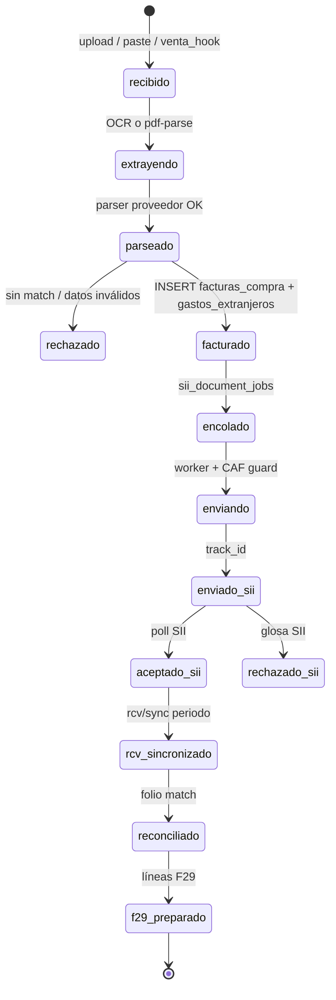

# Soberanía Fiscal — Plataforma tributaria y comercio chileno propia

> **Enjambre Legado no integra facturadores de terceros.** Construimos el motor fiscal, el pipeline documental y la operación e-commerce en nuestro monorepo, con nuestra filosofía biocultural y profundidad territorial.
>
> Referencia de mercado (solo competitiva): startups como Wasabil resuelven un subconjunto — Factura de Compra para servicios digitales, emisión gestionada, RCV. **Nuestro objetivo es cubrir ese subconjunto y el ecosistema completo** (venta D2C, POS feria, reps, logística, conciliación, F29, trazabilidad) en una sola fuente de verdad.

**Estado del documento:** Especificación viva — Junio 2026  
**Audiencia:** Producto, ingeniería, contador/a aliado  
**Relacionado:** [`CONSTITUTION.md`](./CONSTITUTION.md), [`ARCHITECTURE.md`](./ARCHITECTURE.md), [`DATABASE_SCHEMA.md`](./DATABASE_SCHEMA.md), [`TECHNICAL_DEBT.md`](./TECHNICAL_DEBT.md)

---

## 1. Manifiesto

### 1.1 Qué rechazamos

- Delegar la **firma, folios o emisión SII** a SaaS externos como capa obligatoria.
- “Pegar” APIs de facturación que nos convierten en revendedores de otro producto.
- UX contable genérica desconectada de **miel, territorio, colmena y tienda**.

### 1.2 Qué construimos

Un **sistema nervioso fiscal soberano** donde:

1. **Todo documento** (invoice Meta, PDF Uber, boleta POS, venta web) entra por el mismo conducto.
2. **Toda lógica tributaria** vive en `@enjambre/contable` (testeable, sin framework).
3. **Toda emisión** pasa por Núcleo BFF + certificado de la empresa (o certificado Enjambre como operador, nunca tercero opaco).
4. **Todo estado** queda en Postgres con RLS — auditable, idempotente, multi-empresa.
5. **Tienda, Campo y Núcleo** comparten ventas, stock, comisiones y obligaciones SII sin duplicar verdad.

### 1.3 Ventaja competitiva (más allá del mercado facturador)

| Dimensión | Facturadores tradicionales | Enjambre Legado |
|-----------|---------------------------|-----------------|
| Origen del gasto/ingreso | Solo documentos subidos | **Venta web + POS + feria + import** unificados |
| Narrativa de producto | Ninguna | **Trazabilidad colmena → lote → QR** |
| Fidelización | Puntos genéricos | **Guardián del bosque** ligado a impacto real |
| Canal Chile | E-commerce desconectado | **Flow + Transbank + ritual suscripción** nativos |
| Territorio | Software commodity | **Marca biocultural** + operación Chiloé |

---

## 2. Principios de ingeniería fiscal

1. **Package-first:** dominio en `packages/contable`, `packages/fiscal` (nuevo), nunca lógica SII en componentes React.
2. **Pipeline explícito:** cada documento tiene `estado` y `idempotency_key` — sin “magia” entre parse y RCV.
3. **Fail closed:** sin CAF, sin certificado o sin folio → no se emite; se encola y se alerta.
4. **Retry con cola:** emisión SII asíncrona con reintentos exponenciales y dead-letter (igual que `notification_queue`).
5. **RCV es lectura oficial:** no “inventamos” el RCV; **emitimos → SII acepta → sincronizamos RCV → reconciliamos**.
6. **Cero `any` en boundaries:** Zod en BFF; parsers con tests Vitest por proveedor.
7. **Soberanía de datos:** PDFs y XML en Storage propio (`sii-documents` bucket), no en silo externo.

---

## 3. Mapa de capacidades objetivo

Leyenda: ✅ existe · 🟡 parcial · ⬜ por construir

### 3.1 Emisión DTE (salida — lo que vendemos)

| Código | Documento | Estado | Ruta / módulo |
|--------|-----------|--------|---------------|
| 33 | Factura electrónica | 🟡 | `sii/dte.ts`, checkout hook pendiente |
| 34 | Factura exenta | 🟡 | `sii/dte.ts` |
| 39 | Boleta electrónica | 🟡 | `emit-boleta-venta.ts` + `fulfillCheckout` (`SII_AUTO_EMIT_BOLETA`) |
| 41 | Boleta exenta | 🟡 | `sii/dte.ts` |
| 52 | Guía de despacho | 🟡 | `sii/dte.ts` + logística |
| 56 | Nota de débito | 🟡 | `sii/dte.ts` |
| 61 | Nota de crédito | 🟡 | `sii/dte.ts` |
| 110 | Boleta honorarios terceros | 🟡 | `sii/honorarios.ts` |

### 3.2 Compras y servicios digitales (entrada — superar facturadores)

| Capacidad | Estado | Hoy en código |
|-----------|--------|---------------|
| Detección proveedor por texto | ✅ | `gasto-extranjero.ts` + 7 parsers |
| Conversión USD/EUR → CLP | ✅ | `tasa-cambio.ts` + `tasas_cambio_historial` |
| Factura de Compra tipo 46 en DB | ✅ | `createFacturaCompraFromGasto` |
| Emisión XML firmado al SII | ✅ | `emit-factura-compra.ts` + `facturas/:id/enviar-sii` |
| **Subida PDF/imagen/email** | ⬜ | — |
| **OCR + extracción estructurada** | ⬜ | — |
| **Pipeline 1-click** parse→emit→poll→RCV | 🟡 | `POST /gastos-extranjero/procesar` + UI; falta bandeja y cola `sii_document_jobs` |
| Proveedores extendidos (OpenAI, Workspace, Vercel…) | ⬜ | extensible vía `ReceiptParser` |
| Ingesta masiva / bandeja | ⬜ | — |
| Conexión billing API (Meta/Google) opcional | ⬜ | fase 3, siempre con export soberano |

### 3.3 RCV, F29 y cierre

| Capacidad | Estado | Hoy en código |
|-----------|--------|---------------|
| Sync RCV compras/ventas desde SII | ✅ | `sii/rcv.ts` |
| Reconciliar folio local ↔ RCV | ✅ | `rcv-sync.ts` → `reconciliarRcv()` |
| F29 borrador / líneas compra | 🟡 | `impuestos.ts`, `f29.ts` |
| Alerta CAF &lt; N folios | ✅ | `caf-guard.ts` + `monitorCafFolios` → `notification_queue` |
| Auto-sync RCV post-emisión aceptada | ✅ | pipeline + cron `/api/cron/fiscal` cada 2 min |

### 3.4 Comercio chileno (potenciadores rentabilidad)

| Capacidad | Estado | App |
|-----------|--------|-----|
| Checkout Flow + Transbank | ✅ | Tienda + Núcleo BFF |
| Stock gate atómico | ✅ | `cart-stock.ts` |
| Comisiones reps + caja + leaderboard | ✅ | Campo + Núcleo |
| Ritual suscripción con pago | ✅ | `subscriptions/checkout` |
| Referidos + loyalty | 🟡 | Perfil + RPC; ver [`COMERCIO_SOBERANO.md`](./COMERCIO_SOBERANO.md) §5 (wiring incompleto) |
| Conciliación banco ↔ documentos | 🟡 | `conciliaciones`, Banco Chile |
| DTE automático post-venta web | 🟡 | en progreso |
| Trazabilidad lote → producto → QR | 🟡 | schema listo, UI parcial |

---

## 4. Arquitectura objetivo

```
┌─────────────────────────────────────────────────────────────────────────────┐
│                         APPS (experiencia por rol)                          │
├──────────────────┬──────────────────┬───────────────────────────────────────┤
│ Tienda (D2C)     │ Núcleo (fiscal)  │ Campo (POS)                           │
│ checkout, perfil │ /sii bandeja     │ venta → boleta/factura                │
│ impacto guardián │ F29, RCV, caja   │ comisiones en vivo                    │
└────────┬─────────┴────────┬─────────┴───────────────┬───────────────────────┘
         │                  │                         │
         ▼                  ▼                         ▼
┌─────────────────────────────────────────────────────────────────────────────┐
│                    packages/fiscal (NUEVO) + contable                       │
├─────────────────────────────────────────────────────────────────────────────┤
│ contable/     IVA, RUT, DTE XML, parsers, F29, RCV types                    │
│ fiscal/       Pipeline, jobs, CAF guard, ingestión documentos (SoT proceso) │
│ pricing/      Precios rol/volumen (ya existe)                                 │
│ auth/         Multi-tenant empresa                                            │
└────────┬────────────────────────────────────────────────────────────────────┘
         │
         ▼
┌─────────────────────────────────────────────────────────────────────────────┐
│                         SUPABASE (verdad + colas)                           │
├─────────────────────────────────────────────────────────────────────────────┤
│ fiscal_documents │ gastos_extranjeros │ facturas_* │ sii_caf │ rcv_*        │
│ sii_document_jobs│ notification_queue │ ventas     │ checkout_sessions      │
│ Storage: sii-documents/ (PDF, XML, receipts)                                │
└────────┬────────────────────────────────────────────────────────────────────┘
         │
         ▼
┌─────────────────────────────────────────────────────────────────────────────┐
│                    WORKERS (Vercel Cron / pg_cron futuro)                    │
├─────────────────────────────────────────────────────────────────────────────┤
│ processFiscalJobs     emit, poll track_id, sync rcv period                  │
│ monitorCafFolios        alert if folios < threshold                           │
│ processNotificationQueue (ya existe)                                          │
└─────────────────────────────────────────────────────────────────────────────┘
         │
         ▼
                    SII Chile (certificación → producción)
```

### 4.1 Nuevo package `@enjambre/fiscal`

Responsabilidades (sin UI):

- `DocumentIngestionService` — PDF/texto/imagen → texto normalizado
- `ReceiptOrchestrator` — delega a parsers `contable`, fallback LLM estructurado (opcional, on-prem friendly)
- `EmissionPipeline` — estados, idempotencia, encolado
- `CafGuard` — validación folios antes de emitir
- `RcvReconciler` — post-aceptación

`@enjambre/contable` permanece **puro** (sin Supabase, sin fetch de red excepto mindicador).

---

## 5. Pipeline soberano: documento → RCV

Flujo canónico que debemos implementar y blindar (reemplaza cualquier UX de facturador externo):



### 5.1 Entradas soportadas (fase 1 → 3)

| Fuente | Mecanismo | Prioridad |
|--------|-----------|-----------|
| Pegar texto invoice | `GastoExtranjeroTab` → `POST /procesar` | P0 ✅ cableado (Jun 2026) |
| Subir PDF | `sii-documents` + pdf-parse | P0 |
| Subir imagen (PNG/JPG) | OCR Tesseract o visión local | P1 |
| Email forward `gastos@empresa.enjambrelegado.cl` | Edge ingest → Storage | P2 |
| Webhook venta Tienda/Campo | `fulfillCheckout` → boleta 39 | P0 ✅ (flag `SII_AUTO_EMIT_BOLETA=true`) |
| CSV bulk histórico | Import job | P2 |

### 5.2 Idempotencia

Clave sugerida: `sha256(empresa_id + proveedor_id + numero_documento + fecha_emision + monto_total)`  
Evita duplicar Factura de Compra si el usuario sube el mismo invoice dos veces.

---

## 6. Modelo de datos (extensiones propuestas)

Migración futura `63_fiscal_sovereignty.sql` (borrador):

```sql
-- Cola de emisión SII (paralelo a notification_queue)
CREATE TABLE sii_document_jobs (
  id uuid PRIMARY KEY DEFAULT gen_random_uuid(),
  empresa_id uuid NOT NULL REFERENCES empresas(id),
  source_type text NOT NULL, -- gasto_extranjero | venta | manual
  source_id uuid NOT NULL,
  tipo_dte int NOT NULL,
  idempotency_key text NOT NULL,
  status text NOT NULL DEFAULT 'pending'
    CHECK (status IN ('pending','processing','completed','failed','dead_letter')),
  attempts int NOT NULL DEFAULT 0,
  last_error text,
  payload jsonb NOT NULL DEFAULT '{}',
  scheduled_at timestamptz NOT NULL DEFAULT now(),
  completed_at timestamptz,
  UNIQUE (empresa_id, idempotency_key)
);

-- Documentos fuente (PDF, imágenes)
CREATE TABLE fiscal_documents (
  id uuid PRIMARY KEY DEFAULT gen_random_uuid(),
  empresa_id uuid NOT NULL REFERENCES empresas(id),
  storage_path text NOT NULL,
  mime_type text NOT NULL,
  sha256 text NOT NULL,
  extracted_text text,
  proveedor_detectado text,
  gasto_extranjero_id uuid REFERENCES gastos_extranjeros(id),
  created_at timestamptz NOT NULL DEFAULT now()
);

-- Extender gastos_extranjeros
ALTER TABLE gastos_extranjeros
  ADD COLUMN IF NOT EXISTS fiscal_document_id uuid REFERENCES fiscal_documents(id),
  ADD COLUMN IF NOT EXISTS idempotency_key text,
  ADD COLUMN IF NOT EXISTS rcv_registro_id uuid REFERENCES rcv_registros(id);
```

RLS: `has_empresa_access(empresa_id)` en todas. Jobs: solo `service_role` + worker.

---

## 7. API soberana (Núcleo BFF)

Prefijo: `/api/sii` (existente). Endpoints a consolidar:

| Método | Ruta | Acción |
|--------|------|--------|
| `POST` | `/gastos-extranjero/upload` | PDF/imagen → Storage + `fiscal_documents` |
| `POST` | `/gastos-extranjero/procesar` | Pipeline completo (parse → factura → encolar emisión) |
| `POST` | `/gastos-extranjero/procesar/:id/reintentar` | Dead letter recovery |
| `GET` | `/gastos-extranjero/bandeja` | Cola con filtros por estado |
| `POST` | `/facturas/:id/enviar-sii` | Ya existe — llamado por worker |
| `GET` | `/facturas/:id/poll-sii` | Ya existe |
| `POST` | `/rcv/:periodo/sync` | Ya existe — disparado post-aceptación |
| `GET` | `/caf/estado` | Folios restantes por tipo DTE + alertas |
| `POST` | `/ventas/:ventaId/emitir-dte` | Boleta/factura post-checkout |
| `GET` | `/cron/fiscal` | Worker (CRON_SECRET) — procesa `sii_document_jobs` |

**No habrá** `/api/wasabil/*` ni adaptadores a facturadores externos.

---

## 8. Experiencia Núcleo — “Bandeja Fiscal”

Reemplazar tabs dispersos por una **Bandeja Fiscal** unificada en `/sii`:

1. **Entrada** — drag & drop, paste, lista de pendientes
2. **Revisión** — preview montos, proveedor, tasa cambio (humano aprueba o corrige)
3. **Emisión** — progreso en vivo (encolado → SII → aceptado)
4. **RCV** — match automático con registro oficial
5. **Cierre** — vista F29 del período con gaps resaltados

Diseño: misma estética editorial Núcleo (cards, tipografía display, estados con color semántico `success/warning/destructive`).

---

## 9. Sinergia e-commerce Chile

El motor fiscal no vive aislado — es lo que hace rentable el resto:

```
Tienda checkout ──► venta + stock ──► emitir boleta 39 ──► RCV ventas
Campo POS ────────► venta feria ───► boleta/factura ───► comisión rep
Ritual Flow ──────► suscripción ───► factura recurrente (fase 2)
Gasto Meta PDF ───► FC 46 ─────────► crédito IVA ──────► F29 compras
Banco Chile ──────► movimiento ────► conciliación ────► match documento
```

**Meta de margen:** reducir horas contador/a manual de N horas/mes a revisión de excepciones en Bandeja Fiscal.

---

## 10. Roadmap de ejecución

### Ola 1 — Cerrar y blindar (2 semanas)

| ID | Entrega | DoD |
|----|---------|-----|
| S1.1 | Cablear `GastoExtranjeroTab` → `POST /procesar` | ✅ Un click hasta `enviado_sii` (emisión síncrona; poll async vía cron) |
| S1.2 | Worker poll `track_id` → `aceptado_sii` | ✅ `pending-poll-worker` + `/api/cron/fiscal` + tests |
| S1.3 | Post-aceptación: `rcv/sync` automático del período | ✅ `syncRcvPeriod` en pipeline y worker |
| S1.4 | CAF guard + alerta email (`notification_queue`) | ✅ `monitorCafFolios` en cron fiscal; dedupe por lote CAF |
| S1.5 | DTE post-checkout ventas Tienda | ✅ Boleta 39 en `fulfillCheckout` (no bloquea checkout) |
| S1.6 | E2E: compra + FC46 desde texto | ✅ Vitest integración (mock SII) — 101 tests núcleo |

### Ola 2 — Soberanía documental (3 semanas)

| ID | Entrega | DoD |
|----|---------|-----|
| S2.1 | Package `@enjambre/fiscal` + migración 63–64 | ✅ Pipeline en package; RLS jobs fix |
| S2.2 | Upload PDF/imagen + `fiscal_documents` | ✅ Storage RLS; OCR tesseract |
| S2.3 | `POST /procesar` unificado | ✅ `fiscal_document_id` + estados |
| S2.4 | Bandeja Fiscal UI | ✅ Reemplaza textarea-only |
| S2.5 | +5 parsers (OpenAI, Google Workspace, Vercel, Notion, Canva) | ✅ 12 proveedores total |
| S2.6 | F29 líneas desde FC aceptadas | ✅ `impuestos.ts` + `ImpuestosTab` |

### Ola 3 — Escala marca (4–6 semanas)

| ID | Entrega | DoD |
|----|---------|-----|
| S3.1 | Ingesta email + bulk CSV | ✅ `import-csv` + `ingest-email` |
| S3.2 | Conciliación banco auto ≥90% match | 🟡 Métricas API; match auto en progreso |
| S3.3 | API pública documentada (OpenAPI) para partners | 🟡 Esqueleto `/api/sii/openapi/json` |
| S3.4 | Trazabilidad QR → lote → DTE venta | 🟡 `GET /trazabilidad/:codigo` |
| S3.5 | Certificación SII producción checklist | 🟡 Checklist API; go-live pendiente |

---

## 11. Métricas de soberanía

| Métrica | Objetivo 90 días |
|---------|------------------|
| % ventas web con DTE emitido &lt; 5 min | ≥ 95% |
| % invoices digitales extranjeros procesados sin edición manual | ≥ 80% |
| % FC46 aceptadas en primer intento | ≥ 90% |
| Tiempo medio documento → RCV reconciliado | &lt; 24 h |
| Folios CAF agotados sin alerta previa | 0 eventos |
| Dependencia APIs facturación terceros | **0** |

---

## 12. Riesgos y mitigaciones

| Riesgo | Mitigación |
|--------|------------|
| Certificación SII larga | Ambiente certificación + tests automatizados XML |
| Parsers frágiles ante cambio invoice | Tests fixture por proveedor + revisión humana en bandeja |
| OCR impreciso | Siempre mostrar preview antes de emitir; nunca auto-emit sin confianza ≥ umbral |
| Carga serverless | Jobs en Postgres, no en memoria; worker idempotente |
| Complejidad equipo pequeño | Olas secuenciales; package `fiscal` evita spaghetti en routes |

---

## 13. Decisiones relacionadas

Ver entrada en [`DECISIONS.md`](./DECISIONS.md): **Soberanía fiscal — sin facturadores terceros**.

---

## 14. Próximo paso inmediato

1. Aplicar migraciones `63`+`64` en remoto (`pnpm db:push && pnpm db:typegen`).
2. Validar Bandeja Fiscal en staging con `SII_ASYNC_EMIT` (default async).
3. Cerrar certificación SII producción (S3.5) y Playwright E2E bandeja.

---

*“No conectamos con el ecosistema digital chileno. Lo regeneramos desde el bosque.”*