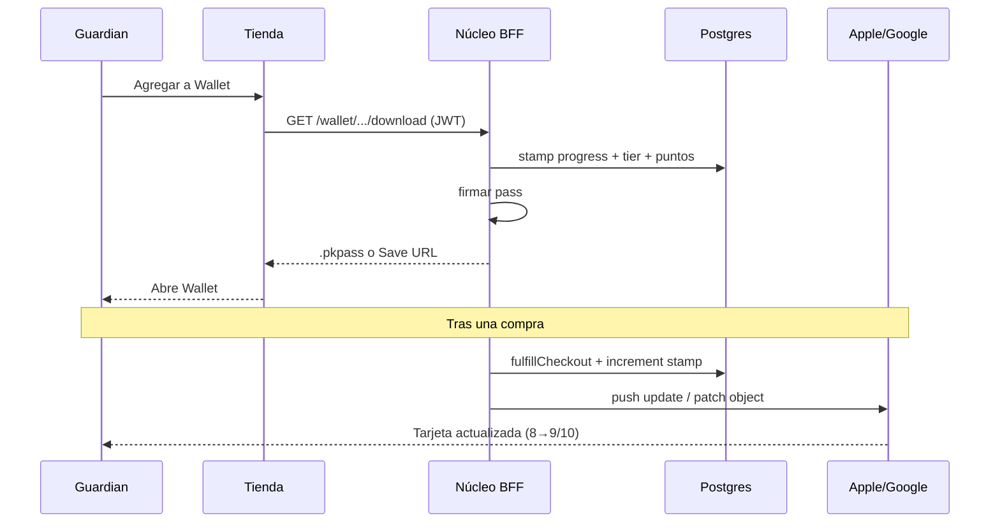

# Wallet Guardian — Tarjetas Apple / Google Wallet

> Llevar el **perfil guardian** en la wallet del teléfono: nombre, tier, impacto y — sobre todo — **cuánto falta de cada producto** para reclamar uno gratis (programa tipo sello / buy X get Y).
>
> **Estado:** Implementado fase B + stubs W1–W2 — Junio 2026 (pass signing Apple/Google requiere certs en prod)  
> **Relacionado:** [`COMERCIO_SOBERANO.md`](./COMERCIO_SOBERANO.md), migración `descuentos` (`buy_x_get_y`), tablas `ciclos` / `puntos_fidelizacion`

---

## 1. Visión de producto

### 1.1 Qué ve el guardian en su teléfono

```
┌──────────────────────────────────────┐
│  🍯  LA OBRERA Y EL ZÁNGANO          │
│  ─────────────────────────────────   │
│  María · Tier ZÁNGANO                │
│                                      │
│  Sachet Miel Ulmo 15g                │
│  ████████░░  8 / 10  → 1 gratis      │
│                                      │
│  Frasco 150g Avellana                │
│  ███░░░░░░░  3 / 6   → 1 gratis      │
│                                      │
│  142 ciclos · 2.340 pts              │
│  [QR para POS / feria]               │
└──────────────────────────────────────┘
```

- **Frente:** marca, nombre, tier, barras de progreso por programa activo.
- **Reverso:** enlace a perfil, términos, soporte, última actualización.
- **QR:** `guardian://scan?uid=…&sig=…` para acreditar compra en POS Campo o canje en tienda.

### 1.2 Por qué wallet y no solo la web

| Canal | Límite | Wallet |
|-------|--------|--------|
| Email post-compra | Se pierde | Push update al comprar |
| App web perfil | Requiere login | Visible en lock screen |
| Apps tipo Stamp Me | Marca del app, no OYZ | Tarjeta **La Obrera y el Zángano** |
| Shopify loyalty app | Dentro del ecosistema Shopify | Soberano, mismo dato que `ventas` |

Inspiración directa: **Stamp Me**, **Fivestars**, **PassKit** — pero con **sellos por producto** y tier biocultural, no “10 visitas al café”.

---

## 2. Modelo de datos (fase B — prerequisito)

Hoy `descuentos.tipo = 'buy_x_get_y'` define la regla pero **no hay progreso por usuario**. Propuesta:

### 2.1 `guardian_stamp_programs` (config)

| Columna | Tipo | Ejemplo |
|---------|------|---------|
| `id` | UUID | |
| `empresa_id` | UUID | |
| `producto_id` | UUID | Sachet Ulmo |
| `nombre` | TEXT | "10 sachets → 1 gratis" |
| `unidades_requeridas` | INT | 10 |
| `unidad_gratis` | INT | 1 |
| `activo` | BOOLEAN | true |
| `canal` | TEXT[] | web, feria, local |
| `imagen_url` | TEXT | icono en wallet |

### 2.2 `guardian_stamp_progress` (ledger por usuario)

| Columna | Tipo | Ejemplo |
|---------|------|---------|
| `user_id` | UUID | |
| `program_id` | UUID | |
| `unidades_acumuladas` | INT | 8 |
| `unidades_canjeadas` | INT | 0 |
| `ultima_venta_id` | TEXT | trazabilidad |
| `updated_at` | TIMESTAMPTZ | |

**Cálculo “cuánto falta”:**

```
faltan = unidades_requeridas - (unidades_acumuladas % unidades_requeridas)
```

Si `faltan === 0` → elegible para canje (generar `codigo_canje` o auto-aplicar en checkout).

### 2.3 Integración con ventas existentes

En `fulfillCheckout` (y venta POS Campo), tras insertar `ventas`:

1. Por cada línea del carrito, buscar programas activos para `product_id`.
2. Incrementar `unidades_acumuladas` por `quantity`.
3. Encolar **wallet pass update** (Apple push / Google patch).

**Coexistencia con otros sistemas:**

| Sistema | Rol | Wallet muestra |
|---------|-----|----------------|
| `ciclos` | Tier vital global | Total ciclos + tier |
| `puntos_fidelizacion` | Descuento en checkout | Saldo puntos |
| `guardian_stamp_progress` | Promo por producto | Barras X→gratis |

---

## 3. Apple Wallet (PassKit)

### 3.1 Tipo de pass

- **`storeCard`** (tarjeta de tienda / loyalty) — el adecuado para sellos y QR recurrente.
- Alternativa futura: `generic` si se quiere más campos custom.

### 3.2 Campos sugeridos (`pass.json`)

| Campo PassKit | Contenido OYZ |
|---------------|---------------|
| `organizationName` | La Obrera y el Zángano |
| `description` | Guardian del Bosque |
| `logoText` | OYZ |
| `foregroundColor` / `backgroundColor` | Bosque Ulmo `#0A3D2F`, Oro Miel `#D4A017` |
| `barcode` | QR con token firmado |
| `storeCard.primaryFields` | Tier + nombre |
| `storeCard.secondaryFields` | Programa 1: "8/10 sachets" |
| `storeCard.auxiliaryFields` | Programa 2, puntos, ciclos |
| `backFields` | Link perfil, reglas, impacto |

### 3.3 Infra técnica Apple

| Requisito | Detalle |
|-----------|---------|
| Apple Developer Program | Team ID, Pass Type ID (`pass.cl.oyz.guardian`) |
| Certificado | **Pass Type ID Certificate** (.p12) — solo en servidor |
| Firma | `.pkpass` = ZIP con `manifest.json` + `signature` |
| Actualizaciones | **PassKit Web Service**: `webServiceURL` + `authenticationToken` por pass |
| Push | APNs con `pushToken` del dispositivo cuando el usuario agrega el pass |

### 3.4 Rutas BFF propuestas (Núcleo)

```
POST /api/wallet/apple/register     — dispositivo registra pass (PassKit WS)
GET  /api/wallet/apple/pass/:serial — descarga .pkpass actualizado
POST /api/wallet/apple/push         — interno: tras compra, notificar update
GET  /api/wallet/apple/download     — tienda: generar pass inicial (auth JWT)
```

**Tabla auxiliar:** `wallet_pass_registrations` (device_library_id, pass_type_id, serial_number, push_token).

---

## 4. Google Wallet (Loyalty Class + Object)

### 4.1 Modelo Google

- **Loyalty Class** — plantilla de la tarjeta (marca, colores, issuer).
- **Loyalty Object** — instancia por usuario (`objectId = issuerId.userId`).

### 4.2 Campos

| Google Wallet API | Contenido OYZ |
|-------------------|---------------|
| `loyaltyPoints.label` | "Sachets Ulmo" |
| `loyaltyPoints.balance` | `{ "int": 8 }` con `secondaryLoyaltyPoints` "de 10" |
| `barcode` | QR igual que Apple |
| `textModulesData` | Tier, ciclos, impacto |
| `linksModuleData` | Perfil, tienda |

### 4.3 Infra técnica Google

| Requisito | Detalle |
|-----------|---------|
| Google Cloud project | Wallet API habilitada |
| Service account | JWT para firmar `loyaltyObjects` |
| Issuer ID | Google Pay & Wallet Console |

### 4.4 Rutas propuestas

```
POST /api/wallet/google/save-link   — JWT "Save to Google Wallet" (auth)
PATCH /api/wallet/google/object     — actualizar progreso post-compra
```

Librería candidata: `@google-wallet/loyalty` o REST directo desde `@enjambre/wallet`.

---

## 5. Paquete `@enjambre/wallet` (propuesto)

```
packages/wallet/
  src/
    stamp-progress.ts      — calcular faltan, elegibilidad canje
    apple/
      pass-builder.ts      — JSON + assets → .pkpass
      pass-signer.ts       — firma OpenSSL
      web-service.ts       — handlers PassKit WS
    google/
      loyalty-class.ts
      loyalty-object.ts
    types.ts
```

**Dependencias:** solo servidor; nunca claves en cliente.

**Env vars:**

```
APPLE_PASS_TYPE_IDENTIFIER=pass.cl.oyz.guardian
APPLE_TEAM_IDENTIFIER=XXXXXXXX
APPLE_PASS_CERT_P12_BASE64=...
APPLE_PASS_CERT_PASSWORD=...
APPLE_WWDR_CERT_PEM=...
GOOGLE_WALLET_ISSUER_ID=...
GOOGLE_WALLET_SERVICE_ACCOUNT_JSON=...
WALLET_QR_SIGNING_SECRET=...
```

---

## 6. UX en Tienda

### 6.1 Puntos de entrada

| Ubicación | CTA |
|-----------|-----|
| `/perfil` | "Agregar a Apple Wallet" / "Guardar en Google Wallet" |
| Post-checkout éxito | Mismo CTA si `buyer_mode=legado` |
| `/perfil/canje` | Mostrar elegibilidad sello + canje |

### 6.2 Flujo



---

## 7. Seguridad

1. **QR firmado** — HMAC(`user_id|program_id|ts`, secret); POS valida en Campo.
2. **Serial number** — `oyz-{userId}-{programId}`; no secuencial adivinable.
3. **RLS** — `guardian_stamp_progress` solo `user_id = auth.uid()` lectura; escritura `service_role` + triggers.
4. **Rate limit** — descarga pass: 10/h por usuario.
5. **No PII en QR** — solo token opaco; lookup server-side.

---

## 8. Fases de implementación

| Fase | Entregable | Dependencias |
|------|------------|--------------|
| **B1** | Migración `guardian_stamp_programs` + `guardian_stamp_progress` | — |
| **B2** | Incremento en `fulfillCheckout` + POS | B1 |
| **B3** | UI perfil: barras progreso + copy "te faltan N" | B2 |
| **W1** | `@enjambre/wallet` Apple `.pkpass` estático (sin push) | B2, certs Apple |
| **W2** | Google Save to Wallet link | B2, Google issuer |
| **W3** | PassKit Web Service + push updates | W1 |
| **W4** | QR scan en Campo POS | W1, `claim` flow existente |

---

## 9. Ejemplo de configuración de programa

```json
{
  "nombre": "Décimo sachet regala",
  "producto_slug": "sachet-miel-ulmo-15g",
  "unidades_requeridas": 10,
  "unidad_gratis": 1,
  "canales": ["web", "feria", "local"],
  "wallet_label": "Sachets Ulmo",
  "wallet_icon": "https://tienda.../icons/sachet.png"
}
```

Mensaje en wallet cuando `faltan = 2`:

> **Te faltan 2 sachets** para tu crema gratis del bosque.

---

## 10. Estado actual del repo

| Pieza | Estado |
|-------|--------|
| Tier / ciclos | ✅ `user_tier_view`, `mi-legado-client.tsx` |
| Puntos | 🟡 schema + UI; wiring checkout incompleto |
| buy_x_get_y | 🟡 solo en `descuentos` SQL |
| Progreso por producto | ✅ mig **78**, `guardian_stamp_progress`, checkout + claim |
| PassKit / Google Wallet | 🟡 `@enjambre/wallet`, BFF `/api/wallet/*` (unsigned hasta certs) |
| `puntos_reclamo` en perfil | ⚠️ referenciado en `perfil/page.tsx` sin migración visible — limpiar o crear |

---

*Última actualización: Junio 2026*